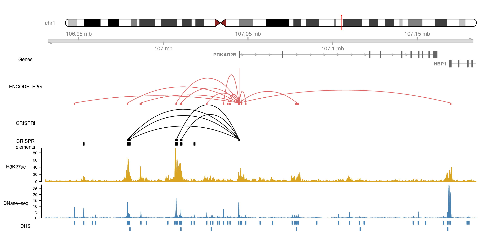
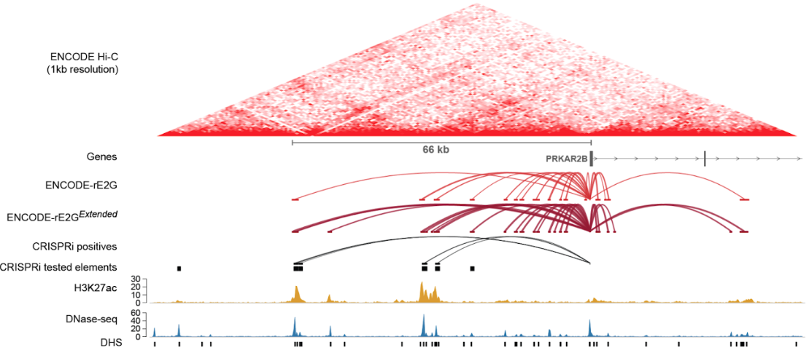
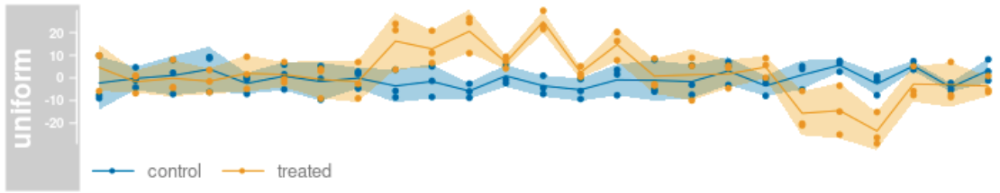
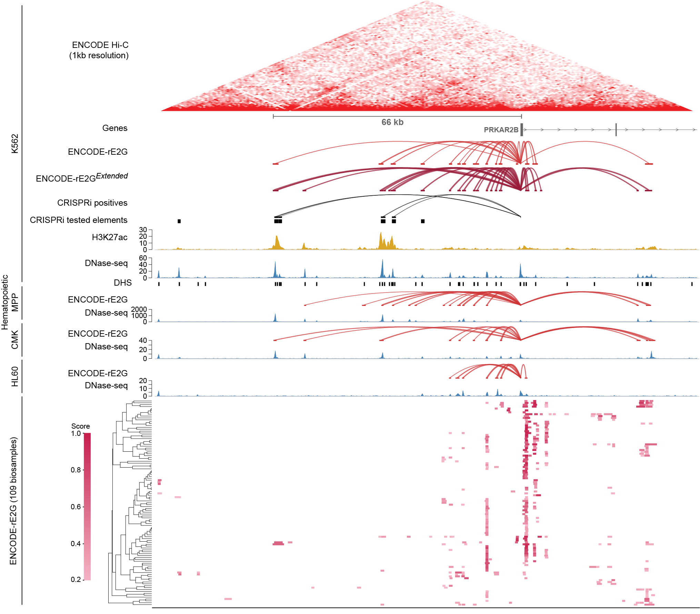

```{r setup, include=FALSE}
knitr::opts_chunk$set(cache = TRUE, warning = FALSE)
options(timeout = 240)  # increase timeout limit for file downloads
```

```{r attachPkgs, warning=FALSE, message=FALSE, echo=FALSE}
library(Gviz)
library(GenomicInteractions)
library(rtracklayer)
library(dplyr)
library(data.table)
```

## Overview

- IGV is a powerful tool to interactively explore loci across the genome

- However, it has limitations when making locus plots for publication figures

- Gviz R-package on Bioconductor allows making custom locus plots in R:
  - Highly customizable plots
  - Programmatic approach helps with reproducibility
  - Allows to write functions and scripts that easily generalize across many loci

- A detailed overview of the package can be found here: https://bioconductor.org/packages/release/bioc/vignettes/Gviz/inst/doc/Gviz.html

- **Gviz is not an IGV replacement**
  
## Goal of this tutorial

Learn how to make this plot in R:

{height=90%, width=90%}

## Installing required packages

If you want follow along the tutorial or want to try making your own plots, make sure
that you've got these packages installed:

```{r, eval=FALSE}
# make sure Bioconductor installer is installed
if (!require("BiocManager", quietly = TRUE))
    install.packages("BiocManager")

# install Bioconductor packages
BiocManager::install("Gviz")
BiocManager::install("GenomicInteractions")
BiocManager::install("rtracklayer")

# install packages from CRAN
install.packages("dplyr")
install.packages("data.table")
install.packages("R.utils")
```

## Let's start small

Plots in Gviz are built by adding different tracks to the plot, similar to adding
tracks in a genome browser. Let's start with a simple plot that shows genes.

Load genome annotations from a .gtf file:

```{r}
# import gtf file containing GENCODE v29 genome annotations as a GRanges object
annot <- import("https://ftp.ebi.ac.uk/pub/databases/gencode/Gencode_human/release_29/gencode.v29.annotation.gtf.gz",
                format = "gtf")

# extract annotations on protein-coding genes and lincRNAs exons
genes <- annot[annot$type == "exon" &
                 annot$gene_type %in% c("protein_coding", "lincRNA") & 
                 annot$transcript_type %in% c("protein_coding", "lincRNA")]
```

## Let's start small

Next, we can create a data frame containing required gene annotation information.

```{r}
genes <- genes %>% 
    as.data.frame() %>%
    select(chromosome = seqnames, start, end, width, strand, feature = gene_type,
           gene = gene_id, exon = exon_id, transcript = transcript_id,
           symbol = gene_name)

head(genes, 2)
```

## Let's start small

We can now create a `GeneRegionTrack` object that contains our gene annotations.
Additionally, we can easily create chromosome ideogram and genome axis tracks.

```{r}
# make genes track
genes_track <- GeneRegionTrack(genes, genome = "hg38", name = "Genes",
                               transcriptAnnotation = "symbol")

# create chromosome ideogram and axis track
chr_track <- IdeogramTrack(genome = "hg38", chromosome = "chr7")
axis_track <- GenomeAxisTrack()
```

## Let's start small

The `plotTracks` function prints our tracks for a specified region of the genome.
Note how we specify the field of view coordinates. Track sizes are used to set the
relative height of the individual tracks in the plot.

```{r, fig.show='hide'}
# coordinates of locus to be shown in plot
chr <- "chr7"
start <- 106692877
end <- 107374371

# relative heights for all tracks
track_sizes <- c(1, 1, 2)

# make locus plot showing genes track
plotTracks(trackList = list(chr_track, axis_track, genes_track), sizes = track_sizes,
           chromosome = chr, from = start, to = end)
```

## Let's start small

```{r, echo=FALSE, fig.height=4, fig.width=10}
# actually print plot for slides
plotTracks(trackList = list(chr_track, axis_track, genes_track), sizes = track_sizes,
           chromosome = chr, from = start, to = end)
```

## Cleaning up the genes track

By default, the genes track shows each annotated transcript. To declutter the track,
we can collapse all transcripts per genes into a "meta transcript".

While we're at it, let's also change the color for the genes track.

```{r editGenesTrack, fig.show='hide'}
# recreate genes track with collapsed transcripts and custom color
genes_track <- GeneRegionTrack(genes, genome = "hg38", name = "Genes",
                               transcriptAnnotation = "symbol",
                               collapseTranscripts = "meta",
                               col = "#666666", fill = "#666666",)

# print locus plot
plotTracks(trackList = list(chr_track, axis_track, genes_track), sizes = track_sizes,
           chromosome = chr, from = start, to = end)
```

## Cleaning up the genes track

<br>

```{r plotGenesTrack3, echo=FALSE, fig.height=2, fig.width=10}
plotTracks(trackList = list(chr_track, axis_track, genes_track), sizes = track_sizes,
           chromosome = chr, from = start, to = end)
```

<br>

This is equivalent to a collapsed genes track in IGV and probably appropriate for
most locus plot applications.

## Add DNase-seq hypersensitive sites (DHS)

We can add DHS (or any other annotations) using `AnnotationTrack` objects.

Note how we can subset the DHSs to only the ones in our locus to minimize resource
requirements.

```{r}
# load K562 DHS from ENCODE portal
dhs <- fread("https://www.encodeproject.org/files/ENCFF185XRG/@@download/ENCFF185XRG.bed.gz")

# create GRanges object
dhs <- makeGRangesFromDataFrame(dhs, seqnames.field = "V1", start.field = "V2",
                                end.field = "V3", starts.in.df.are.0based = TRUE)

# create annotation tracks containing DHS in our locus
locus <- GRanges(seqnames = chr, ranges = IRanges(start, end))
dhs_track <- AnnotationTrack(subsetByOverlaps(dhs, locus), genome = "hg38",
                             name = "DHS", fill = "steelblue", col = "steelblue")
```

## Add DNase-seq hypersensitive sites (DHS)

```{r, fig.height=2, fig.width=10}
# update relative heights for all tracks
track_sizes <- c(1, 1, 2, 1)

# make locus plot showing all tracks
plotTracks(trackList = list(chr_track, axis_track, genes_track, dhs_track),
           sizes = track_sizes, chromosome = chr, from = start, to = end)
```

## Add chromatin assay signals

Just as in IGV, we can add read coverage tracks from .bigWig or .bam files. For
.bigWig files this can be done using the generic `DataTrack` objects with an
appropriate plot type. This works easiest if the .bigWig file is stored locally.

```{r}
# download DNase-seq bigWig file from ENCODE portal
dnase_url <- "https://www.encodeproject.org/files/ENCFF414OGC/@@download/ENCFF414OGC.bigWig"
download.file(url = dnase_url, destfile = "data/ENCFF414OGC.bigWig")

# download H3K27ac ChIP-seq bigWig file from ENCODE portal
h3k27ac_url <- "https://www.encodeproject.org/files/ENCFF289IVJ/@@download/ENCFF289IVJ.bigWig"
download.file(url = h3k27ac_url, destfile = "data/ENCFF289IVJ.bigWig")
```

## Add DNase-seq signal

To display the data in the .bigWig file similar to read coverage, we can use the
'polygon' plot type.

```{r, fig.show='hide'}
# create DataTrack from DNase-seq bigWig file
dnase_bigwig <- "data/ENCFF414OGC.bigWig"
dnase_track <- DataTrack(range = dnase_bigwig, genome = "hg38", name = "DNase-seq",
                         type = "polygon", fill.mountain = rep("steelblue", 2),
                         col.mountain = "steelblue")

# update relative heights for all tracks
track_sizes <- c(0.5, 0.25, 0.5, 1, 0.5)

# make locus plot showing all tracks
plotTracks(trackList = list(chr_track, axis_track, genes_track, dnase_track,
                            dhs_track),
           sizes = track_sizes, chromosome = chr, from = start, to = end)
```

## Add DNase-seq signal

```{r, echo=FALSE, fig.height=3.5, fig.width=10}
plotTracks(trackList = list(chr_track, axis_track, genes_track, dnase_track, dhs_track),
           sizes = track_sizes, chromosome = chr, from = start, to = end)
```

## Add H3K27ac ChIP-seq signal

Let's do the same with H3K27ac ChIP-seq signal.

```{r, fig.show='hide'}
# create DataTrack from H3K27ac ChIP-seq bigWig file
h3k27ac_bigwig <- "data/ENCFF289IVJ.bigWig"
h3k27ac_track <- DataTrack(range = h3k27ac_bigwig, genome = "hg38", name = "H3K27ac",
                         type = "polygon", fill.mountain = rep("goldenrod", 2),
                         col.mountain = "goldenrod")

# update relative heights for all tracks
track_sizes <- c(0.5, 0.25, 0.5, 1, 1, 0.5)

# make locus plot showing all tracks
plotTracks(trackList = list(chr_track, axis_track, genes_track, h3k27ac_track, 
                            dnase_track, dhs_track),
           sizes = track_sizes, chromosome = chr, from = start, to = end)
```

## Add H3K27ac ChIP-seq signal

```{r, echo=FALSE, fig.height=3.5, fig.width=10}
plotTracks(trackList = list(chr_track, axis_track, genes_track, h3k27ac_track, 
                            dnase_track, dhs_track),
           sizes = track_sizes, chromosome = chr, from = start, to = end)
```

## Adding read coverage from bam files

It's also possible to add read coverage tracks directly from .bam files using
the `AlignmentsTrack` function. This function can extract reads to plot for a given
locus if an index .bai file is present. Alignment tracks provide many options to
display read beyond simple coverage.

```{r, eval=FALSE}
# reads within these coordinates will be included in the track
chr <- "chr7"
start <- 106692877
end <- 107374371

# create alignments track from bam file
bam_track <- AlignmentsTrack("path/to/file.bam", chromosome = chr, from = start,
                             to = end, genome = "hg38", type = "coverage",
                             fill = "firebrick", col = "firebrick",
                             name = "Read coverage")
```

## Adding regulatory interactions

Regulatory interactions between e.g. enhancers and genes can be added using the
`GenomicInteractions` package. This extension to `Gviz` can add arcs for interacting
positions along the genome.

We will start by loading ENCODE-rE2G predicted regulatory interactions from a .bedpe
file. The interactions in the file are stored in a `Pairs` object:

```{r}
e2g_file <- "https://mitra.stanford.edu/engreitz/oak/Projects/Benchmarking/Revisions/Predictors/ENCODE-rE2G/dhs_only/thresholded_bedpe/encode_e2g_predictions_K562_ENCSR000EOT_thresholded_predictions.bedpe.gz"
e2g <- import(e2g_file, format = "bedpe")

head(e2g, 2)
```

## Adding regulatory interactions

We can now use the data on the first and second anchor for each interaction to create
a `GenomicInteraction` object. Note that we have to explicitely call the `first` and
`second` accessor functions due to a conflict with the `data.table` package.

We can include the ENCODE-rE2G score in the `counts` column of the metadata and also
include the name of the involved gene for filtering shown later.

```{r}
# get gene names from interaction names
genes <- sub("\\|.+", "", mcols(e2g)[["name"]])

# create GenomicInteractions object
e2g_int <- GenomicInteractions(anchor1 = S4Vectors::first(e2g),
                               anchor2 = S4Vectors::second(e2g),
                               counts = mcols(e2g)[["score"]],
                               gene = genes)
```

## Adding regulatory interactions

The `InteractionTrack` function is then used to create a track that contains the
predicted enhancer-gene regulatory interactions:

```{r, fig.show='hide'}
# create interaction track to show
e2g_track <- InteractionTrack(e2g_int, chromosome = chr, name = "ENCODE-E2G")

# update relative heights for all tracks
track_sizes <- c(0.5, 0.25, 0.5, 1, 1, 1, 0.5)

# make locus plot showing all tracks
plotTracks(trackList = list(chr_track, axis_track, genes_track, e2g_track,
                            h3k27ac_track, dnase_track, dhs_track),
           sizes = track_sizes, chromosome = chr, from = start, to = end)
```

## Adding regulatory interactions

```{r, echo=FALSE, fig.height=4.5, fig.width=10}
plotTracks(trackList = list(chr_track, axis_track, genes_track, e2g_track,
                            h3k27ac_track, dnase_track, dhs_track),
           sizes = track_sizes, chromosome = chr, from = start, to = end)
```

## Only showing interactions for one gene

Interactions from predictive models like ENCODE-rE2G can get very busy. Depending on
the purpose of a plot, it's possible to only show interactions for one gene by
subsetting the interactions.

```{r, fig.show='hide'}
# subset interactions for only one gene
e2g_int_subset <- e2g_int[e2g_int$gene == "PRKAR2B"]

# re-create interaction track for subset
e2g_track <- InteractionTrack(e2g_int_subset, chromosome = chr, name = "ENCODE-E2G")

# make locus plot showing all tracks
plotTracks(trackList = list(chr_track, axis_track, genes_track, e2g_track,
                            h3k27ac_track, dnase_track, dhs_track),
           sizes = track_sizes, chromosome = chr, from = start, to = end)
```

## Only showing interactions for one gene

```{r, echo=FALSE, fig.height=4.5, fig.width=10}
plotTracks(trackList = list(chr_track, axis_track, genes_track, e2g_track,
                            h3k27ac_track, dnase_track, dhs_track),
           sizes = track_sizes, chromosome = chr, from = start, to = end)
```


## Change field of view

Let's zoom in closer on the PRKAR2B gene to show predicted E-G links close to the
gene promoter.

```{r, fig.show='hide'}
# change coordinates of locus to be shown in plot
chr <- "chr7"
start <- 106930000
end <- 107185000

# make locus plot showing all tracks for new field of view
plotTracks(trackList = list(chr_track, axis_track, genes_track, e2g_track,
                            h3k27ac_track, dnase_track, dhs_track),
           sizes = track_sizes, chromosome = chr, from = start, to = end)
```

## Change field of view

```{r, echo=FALSE, fig.height=4.5, fig.width=10}
plotTracks(trackList = list(chr_track, axis_track, genes_track, e2g_track,
                            h3k27ac_track, dnase_track, dhs_track),
           sizes = track_sizes, chromosome = chr, from = start, to = end)
```

## Changing track appearance

To for instance change the colors of interaction tracks we need to edit the display
parameters of the track object. Let's change the color of the enhancers and the
predicted interaction arcs.

```{r, fig.show='hide'}
# change colors of interaction track stored in display parameters
displayPars(e2g_track) <- list(col.interactions = "#DC6464",
                               col.anchors.line = "#DC6464",
                               col.anchors.fill = "#DC6464",
                               col.outside = "#DC6464")

# make locus plot showing all tracks
plotTracks(trackList = list(chr_track, axis_track, genes_track, e2g_track,
                            h3k27ac_track, dnase_track, dhs_track),
           sizes = track_sizes, chromosome = chr, from = start, to = end)
```

## Changing track appearance

```{r, echo=FALSE, fig.height=4.5, fig.width=10}
plotTracks(trackList = list(chr_track, axis_track, genes_track, e2g_track,
                            h3k27ac_track, dnase_track, dhs_track),
           sizes = track_sizes, chromosome = chr, from = start, to = end)
```

## Adding CRISPR data

Let's use what we have learned so far to add CRISPR data to the plot. We will **1)**
load all tested elements from a .bed file and **2)** load CRISPR positive E-G
interactions from a .bedpe file.

These we will add to the plot using `AnnotationTrack` and `InteractionTrack` objects.

```{r}
# files containing all CRISPR elements and positive E-G pairs
crispr_elements_bed <- "data/crispr_elements.bed"
crispr_pairs_bedpe <- "data/crispr_positives.bedpe"

# import data
crispr_elements <- import(crispr_elements_bed, format = "bed")
crispr_pairs <- import(crispr_pairs_bedpe, format = "bedpe")
```

## Creating a track with all CRISPR elements

Creating an `AnnotationTrack` object from the CRISPR elements stored in a `GRanges`
object is straightforward:

```{r}
# files containing all CRISPR elements and positive E-G pairs
crispr_elements_bed <- "data/crispr_elements.bed"
crispr_pairs_bedpe <- "data/crispr_positives.bedpe"

# import data
crispr_elements <- import(crispr_elements_bed, format = "bed")
crispr_pairs <- import(crispr_pairs_bedpe, format = "bedpe")

# create annotation track containing all tested CRISPR elements
crispr_elements_track <- AnnotationTrack(crispr_elements, genome = "hg38",
                                         name = "CRISPR elements",
                                         fill = "black", col = "black")
```

## Creating a track for CRISPR positive E-G pairs

Next, let's create the interaction track for the CRISPR positive E-G pairs:

```{r}
# create GenomicInteractions object
crispr_pairs_int <- GenomicInteractions(
  anchor1 = S4Vectors::first(crispr_pairs),
  anchor2 = S4Vectors::second(crispr_pairs),
  counts = mcols(crispr_pairs)[["score"]] * -1,
  gene = sub("\\|.+", "", mcols(crispr_pairs)[["name"]])
)

# create interaction track for the selected gene
crispr_pairs_track <- InteractionTrack(
  crispr_pairs_int[crispr_pairs_int$gene == "PRKAR2B"],
  name = "CRISPRi"
)
```

## Creating a track for CRISPR positive E-G pairs

Finally, let's set the track colors and add the two CRISPR tracks to our plot.

```{r, fig.show='hide'}
# change colors of interaction track stored in display parameters
displayPars(crispr_pairs_track) <- list(col.interactions = "black",
                                        col.anchors.line = "black",
                                        col.anchors.fill = "black",
                                        col.outside = "black")

# update relative heights for all tracks
track_sizes <- c(0.5, 0.5, 0.5, 1, 1, 0.15, 1, 1, 0.35)

# make locus plot showing all tracks
plotTracks(trackList = list(chr_track, axis_track, genes_track, e2g_track,
                            crispr_pairs_track, crispr_elements_track,
                            h3k27ac_track, dnase_track, dhs_track),
           sizes = track_sizes, chromosome = chr, from = start, to = end)
```

## Creating a track for CRISPR positive E-G pairs

```{r, echo=FALSE, fig.height=5, fig.width=10}
plotTracks(trackList = list(chr_track, axis_track, genes_track, e2g_track,
                            crispr_pairs_track, crispr_elements_track,
                            h3k27ac_track, dnase_track, dhs_track),
           sizes = track_sizes, chromosome = chr, from = start, to = end)
```

## Preparing the plot for export

As you can notice, some of the labels on the plot aren't visible anymore and maybe
the gray boxes aren't that nice in a figure for publication. We can change the
display parameters of all tracks further to rotate the labels, adjust the font size
and color, and remove the gray title background.

```{r, fig.show='hide'}
# combine all tracks into one list
all_tracks <- list(chr_track, axis_track, genes_track, e2g_track, crispr_pairs_track,
                   crispr_elements_track, h3k27ac_track, dnase_track, dhs_track)

# make locus plot with custom label settings
plotTracks(trackList = all_tracks, sizes = track_sizes, chromosome = chr,
           from = start, to = end, background.title = "transparent",
           col.axis = "black", fontcolor.title = "black", fontface.title = 1,
           rotation.title = 0, cex.axis = 0.5, cex.title = 0.6, margin = 20)
```

## Preparing the plot for export

```{r, echo=FALSE, fig.height=5, fig.width=10}
plotTracks(trackList = all_tracks, sizes = track_sizes, chromosome = chr,
           from = start, to = end, background.title = "transparent",
           col.axis = "black", fontcolor.title = "black", fontface.title = 1,
           rotation.title = 0, cex.axis = 0.5, cex.title = 0.6, margin = 20)
```

## Saving the plot to a file

To export out plot to a .pdf file that can be edited in Adobe Illustrator, we have to
plot it to an open pdf file connection.

```{r, results='hide'}
# open pdf file connection
pdf("figures/locus_plot.pdf", height = 5, width = 10)

# make locus plot with updated display parameters
plotTracks(trackList = all_tracks, sizes = track_sizes, chromosome = chr,
           from = start, to = end, background.title = "transparent",
           col.axis = "black", fontcolor.title = "black", fontface.title = 1,
           rotation.title = 0, cex.axis = 0.5, cex.title = 0.6, margin = 20)

# close pdf file
dev.off()
```

## A note on Hi-C interaction frequency

Unfortunately, there's no easy way to add a Hi-C interaction frequency matrix to the
plot in R. The easiest solution is to generate this plot using juicebox, and then add
it to the plot when editing in Illustrator.

{height=90%, width=90%}

## Getting fancy

These examples only scratch the surface of what's possible with Gviz. The
[Gviz User Guide](https://bioconductor.org/packages/devel/bioc/vignettes/Gviz/inst/doc/Gviz.html)
contains many good examples of how to use the different track objects classes to
display a variety of data, e.g. a measurement along the genome for two groups of
samples including confidence intervals:

```{r, eval=FALSE}
plotTracks(dTrack, groups = rep(c("control", "treated"), each = 3),
           type = c("a", "p", "confint"))
```

{}

***

{height=66%, width=66%}

## Summary

- Gviz is a powerful tool to make custom locus plots for publications and reports.
- The different track classes allow to display a wide variety of data in many
different ways.
- This also allows to write scripts that can quickly create the same plot for
different loci and in put files.
- Gviz isn't interactive and therefore not a genome browser replacement.

## Now it's your turn!

Some suggestions to explore making locus plots with Gviz:

- Try adding other assays to the plot (e.g. CTCF ChIP-seq).
- Make the same plot for another locus. What parts in the code need to be changed?
- Could you write a function to make a locus plot for any locus in the genome? Which
parts of the code need to be turned into parameters of such a function?
- If you have your own data or cell type of interest, start setting up your own locus
plot.
